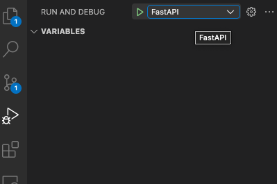
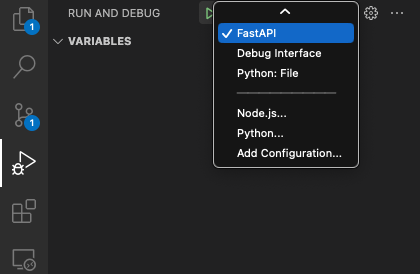

# OpenAI chatbot with Gradio and LangChain: POST vs SSE vs WebSocket

The purpose of this repo is to show how to implement a minimal chatbot using the most 3 popular
technologies used for client-server communication: POST requests, Server-Sent-Events and Websockets. If you are using **VSCode**, you can use the `.vscode/launch.json` to debug and check the differences between the implementations.
_Both client and server side are implemented with python._

 

### Clone and setup:

            git clone https://github.com/AlessandroMondin/gradio_chatbot.git && cd gradio_chatbot
            python3.10 -m venv .venv
            source .venv/bin/activate
            pip install -r requirements.txt

### Add an `.env` file in the source directory and insert your OPENAI key:

        OPENAI_API_KEY=YOUR_OPENAI_KEY

### The two files that you want to check are `src/interface.py` and `src/app.py`.

 
1.  In order check the implementation that uses SSE (streaming), run:

            git checkout 9285960f9d54dad80bf1648277a619249fbe88b8 src/app.py src/interface.py

 

2.  In order to jump to the implementation using Websockets (streaming), go to:

            git checkout 0e3d29dbda7b61e4367ee9e54fb4620eb0fa61a0 src/app.py src/interface.py

 

3.  Lastly, for the implementation that uses POST requests (non-streaming), run:

            git checkout 6e0073c4798403e0cab5e640d1962410d3ca1bc3 src/app.py src/interface.py

### To run the FastAPI app:

        cd src && uvicorn app:app --reload --port 8000

### To run the Gradio interface:

        python src/interface.py

 

### To debug on VSCode:

 

 

